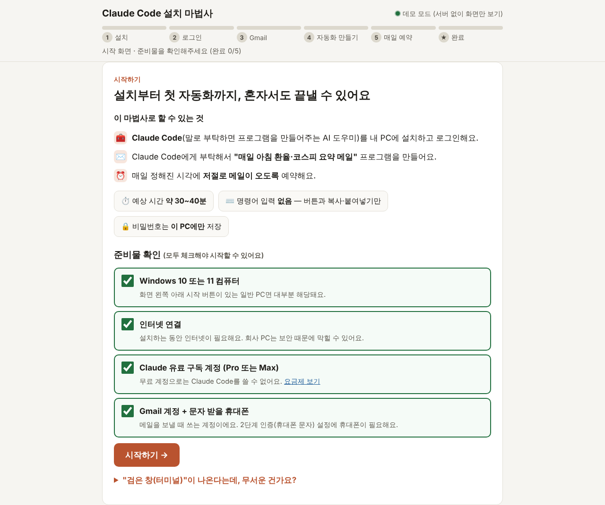
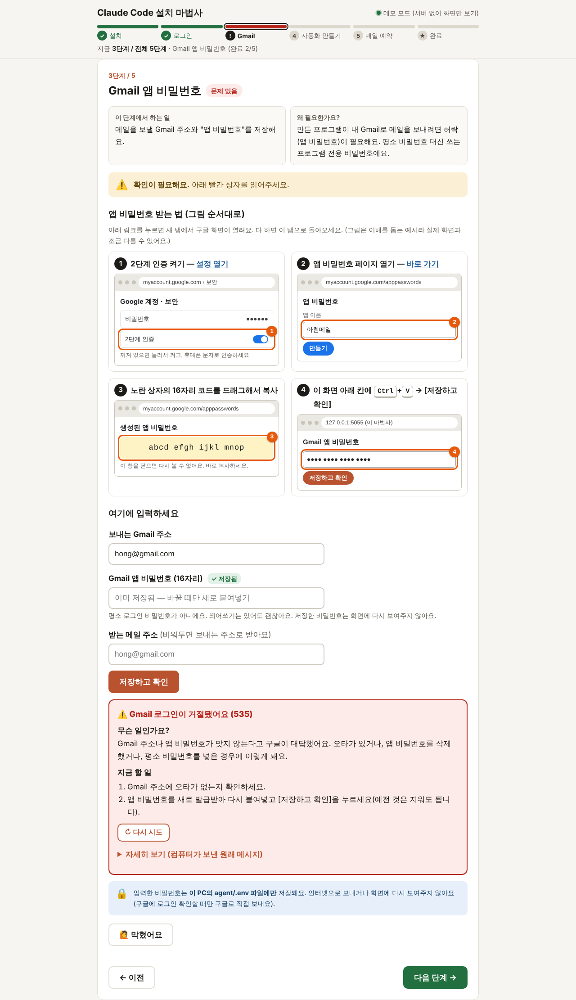
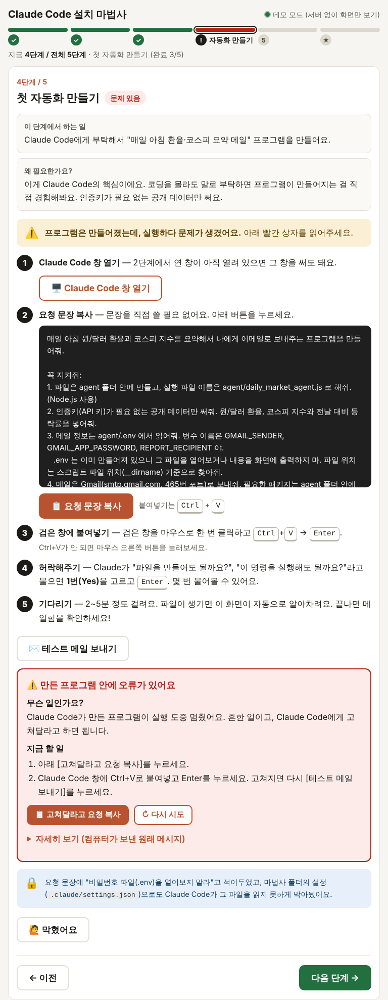

# Claude Code 설치 마법사

컴퓨터가 익숙하지 않은 분도 **더블클릭 한 번으로 시작해서**
[Claude Code](https://claude.com/claude-code) 설치 → 로그인 → 첫 번째 자동화(매일 아침 환율·코스피 요약 메일)까지
혼자 끝낼 수 있게 도와주는 마법사입니다.

- 명령어를 직접 칠 일이 없습니다. 버튼과 [복사] → `Ctrl`+`V`만 씁니다.
- 각 단계는 5초마다 자동으로 확인되어, 끝나면 초록 체크와 함께 다음 단계로 넘어갑니다.
- 막히면 각 단계의 **[막혔어요]** 버튼에 흔한 문제와 해결법이 있습니다.
- 오류가 나면 "무슨 일인지 / 지금 할 일"을 쉬운 말로 보여주고, 원래 메시지는 [자세히 보기]에 접어둡니다.



## 준비물

- Windows 10 또는 11 PC
- 인터넷 연결
- Claude 유료 구독 계정 (Pro 또는 Max)
- Gmail 계정 + 문자 받을 휴대폰 (Gmail 2단계 인증용)

예상 시간: 약 30~40분

## 시작하기

1. [Releases](../../releases) 페이지에서 zip 파일을 받습니다.
2. zip 파일을 마우스 오른쪽 버튼 → **[압축 풀기]**. (zip 안에서 바로 실행하지 마세요.)
3. 풀린 `claude_setup_wizard` 폴더의 **`start.bat`을 더블클릭**합니다.
   - "Windows의 PC 보호" 창이 뜨면 **[추가 정보] → [실행]**을 누르세요. 서명되지 않은 프로그램이라 뜨는 안내입니다.
   - Node.js가 없는 PC라면 한국어 설치 안내 화면이 먼저 열리고 자동 설치(winget)가 시작됩니다.
     "이 앱이 디바이스를 변경할 수 있도록 허용하시겠어요?"에 **[예]** — 이 마법사에서 관리자 허락이 필요한 건 이 한 번뿐입니다.
4. 브라우저에 마법사 화면이 열립니다. **검은 창은 닫지 말고** 그대로 두세요.

## 단계별 화면

| 단계 | 하는 일 | 화면 |
|---|---|---|
| 1. 설치 | [Claude Code 설치하기] 버튼 한 번 (관리자 권한 불필요) | [미완료](docs/screenshots/install-todo-1280.png) · [진행 중](docs/screenshots/install-doing-1280.png) · [완료](docs/screenshots/install-done-1280.png) · [오류](docs/screenshots/install-error-1280.png) |
| 2. 로그인 | [로그인 창 열기] → 브라우저에서 Claude 로그인 → [승인] | [미완료](docs/screenshots/login-todo-1280.png) · [완료](docs/screenshots/login-done-1280.png) · [오류](docs/screenshots/login-error-1280.png) |
| 3. Gmail | 그림 안내대로 16자리 앱 비밀번호를 받아 붙여넣기 → 저장 시 Gmail 로그인까지 자동 확인 | [미완료](docs/screenshots/gmail-todo-1280.png) · [완료](docs/screenshots/gmail-done-1280.png) · [오류(535)](docs/screenshots/gmail-error-1280.png) · [막혔어요](docs/screenshots/gmail-stuck-1280.png) |
| 4. 자동화 만들기 | [요청 문장 복사] → Claude Code 창에 `Ctrl`+`V` → `Enter` → 테스트 메일 | [미완료](docs/screenshots/agent-todo-1280.png) · [진행 중](docs/screenshots/agent-doing-1280.png) · [완료](docs/screenshots/agent-done-1280.png) · [오류](docs/screenshots/agent-error-1280.png) |
| 5. 매일 예약 | 시각을 고르고 [매일 자동 실행 등록] / [지금 한 번 실행] / [예약 해제] | [미완료](docs/screenshots/schedule-todo-1280.png) · [완료](docs/screenshots/schedule-done-1280.png) · [오류](docs/screenshots/schedule-error-1280.png) |
| 완료 | 심화 실습(KRX 섹터 리포트), 클라우드, 모의투자 봇 안내 | [완료 화면](docs/screenshots/finish-1280.png) |

<table><tr>
<td></td>
<td></td>
</tr></table>

> 화면 폭 768px용 스크린샷도 같은 폴더에 `-768.png`로 있습니다.

## 기본 실습 vs 심화 실습

- **기본 실습 (4단계)**: 인증키가 필요 없는 공개 데이터(원/달러 환율, 코스피)만 씁니다. 필요한 건 Gmail 앱 비밀번호뿐입니다.
  만들어지는 파일: `agent/daily_market_agent.js`
- **심화 실습 (완료 화면)**: 한국거래소(KRX) API 키로 업종(섹터)별 등락률 리포트를 만듭니다.
  만들어지는 파일: `agent/sector_report_agent.js`

## 개인정보와 안전

- 이 마법사는 **이 PC 안에서만** 동작합니다(`127.0.0.1`, 기본 포트 5055). 다른 웹사이트가 몰래 명령을 보내지 못하도록 주소와 전용 헤더를 확인합니다.
- Gmail 앱 비밀번호와 KRX 키는 **이 PC의 `agent/.env`에만** 저장됩니다. 화면에 다시 보여주지 않고(저장 여부만 표시), 로그에도 남기지 않습니다.
  실행 결과에 비밀번호가 섞여 나오면 화면에 보내기 전에 `●●●●(숨김)`으로 가립니다.
  - 예외: [저장하고 확인]을 누르면 Gmail 로그인 확인을 위해 **구글 메일 서버(smtp.gmail.com)로만** 직접 보냅니다(메일은 보내지 않음).
- Claude Code에게 주는 요청 문장에 ".env를 열어보지 말라"고 적어두었고, 마법사 폴더의 `.claude/settings.json`으로도 Claude Code가 그 파일을 읽지 못하게 막아두었습니다.
- 소프트웨어는 공식 배포처만 씁니다: Claude Code(npm `@anthropic-ai/claude-code`, [claude.com/claude-code](https://claude.com/claude-code)), Node.js([nodejs.org](https://nodejs.org), winget `OpenJS.NodeJS.LTS`).

## 매일 자동 실행에 대해

- Windows는 **작업 스케줄러**에 `ClaudeDailyMarket`(심화: `ClaudeSectorReport`)라는 이름으로, 내 계정에만 등록합니다(관리자 권한 불필요).
- **PC가 켜져 있어야 실행됩니다.** 정해진 시각에 꺼져 있었으면 다음에 켜고 로그인할 때 한 번 실행합니다. 노트북이 배터리 상태여도 실행되도록 설정합니다.
- 맥/리눅스는 `crontab`에 등록합니다.

## 자주 묻는 질문

1. **start.bat을 눌렀더니 파란 경고창이 떠요.** — [추가 정보] → [실행]. "보안 경고" 창이면 [실행]. 서명되지 않은 프로그램이라 뜨는 안내입니다.
2. **검은 창이 잠깐 떴다가 바로 사라져요.** — zip 안에서 바로 실행한 경우가 많습니다. 압축을 먼저 풀고 실행하세요.
3. **설치가 끝났다는데 계속 "아직 안 함"이에요.** — 검은 창을 닫고 start.bat을 다시 실행하세요(PATH 갱신). 그래도 같으면 PC 재시작.
4. **로그인할 때 브라우저가 안 열려요.** — 검은 창의 `https://` 주소를 드래그 → 마우스 오른쪽 버튼으로 복사 → 브라우저 주소창에 붙여넣기.
5. **무료 Claude 계정으로도 되나요?** — 아니요. Claude Code는 Pro 또는 Max 구독이 필요합니다.
6. **Gmail "앱 비밀번호" 메뉴가 안 보여요.** — 2단계 인증을 먼저 켜세요. 회사·학교 계정은 막혀 있을 수 있으니 개인 Gmail을 쓰세요.
7. **"Gmail 로그인이 거절됐어요 (535)"가 나와요.** — 평소 비밀번호를 넣었거나 앱 비밀번호가 틀린 경우입니다. 새로 만들어 다시 저장하세요.
8. **테스트 메일이 안 와요.** — 스팸함·프로모션 탭 확인. 오류가 나오면 [고쳐달라고 요청 복사]를 눌러 Claude Code에 붙여넣으세요.
9. **매일 아침 검은 창이 잠깐 떴다 사라져요.** — 정상입니다. 예약된 프로그램이 실행되는 모습입니다.
10. **그만 받고 싶어요.** — 5단계 [예약 해제] 후 `claude_setup_wizard` 폴더를 지우면 됩니다.

## 데모 모드 (화면 검토·스크린샷용)

`public/index.html?demo=1`을 브라우저로 열면(서버 없이 파일을 바로 열어도 됨) 오른쪽 아래 조작판으로
각 단계를 미완료 / 진행 중 / 완료 / 오류 상태로 바꿔볼 수 있습니다.

- 특정 화면 바로 열기: `?demo=1&view=gmail&state=error` (앞 단계는 자동으로 완료 처리)
- 조작판 숨기기: `&panel=0`, [막혔어요] 펼치기: `&stuck=1`
- 스크린샷 일괄 생성: `NODE_PATH=$(npm root -g) node scripts/screenshots.js` (Playwright 필요, 콘솔 에러가 있으면 실패)

## 개발자용

```
node server.js              # 마법사 실행 (Node.js 18 이상, 외부 패키지 없음)
node --test test/*.test.js  # 테스트 (오류 분류, .env 저장, 비밀번호 비노출, SMTP, 예약)
python3 scripts/build_release.py v1.1.0   # 배포 zip 만들기 (dist/)
```

- `start.bat`에는 **ASCII 문자만** 넣습니다(cmd.exe 한글 깨짐). 한국어 안내는 `public/node-install.html`과 `server.js`에서 보여줍니다. CI가 검사합니다.
- `v*` 태그를 푸시하면 GitHub Actions(`.github/workflows/release.yml`)가 zip을 만들어 Release에 첨부합니다.
  해당 Release가 없으면 **초안(draft)**으로 만들어두므로 확인 후 공개하면 됩니다. zip에 `agent/`나 `.env`가 들어가면 빌드가 실패합니다.
- 실제 Windows에서 확인할 항목: [docs/WINDOWS_TEST_CHECKLIST.md](docs/WINDOWS_TEST_CHECKLIST.md)

### 폴더 구조

- `start.bat` — 실행 진입점 (Node.js 확인/자동 설치 후 서버 실행)
- `server.js` — 로컬 서버 (Node.js 내장 모듈만 사용): 상태 확인, 설치, 오류 번역, `.env` 저장, Gmail 로그인 확인, 예약
- `public/index.html` — 단계별 마법사 화면 (데모 모드 포함)
- `public/node-install.html` — Node.js 설치 안내(한국어)
- `.claude/settings.json` — Claude Code가 `agent/.env`를 읽지 못하게 하는 설정
- `사용법.txt` — zip에 같이 들어가는 초보자용 안내 (메모장용 UTF-8 BOM)
